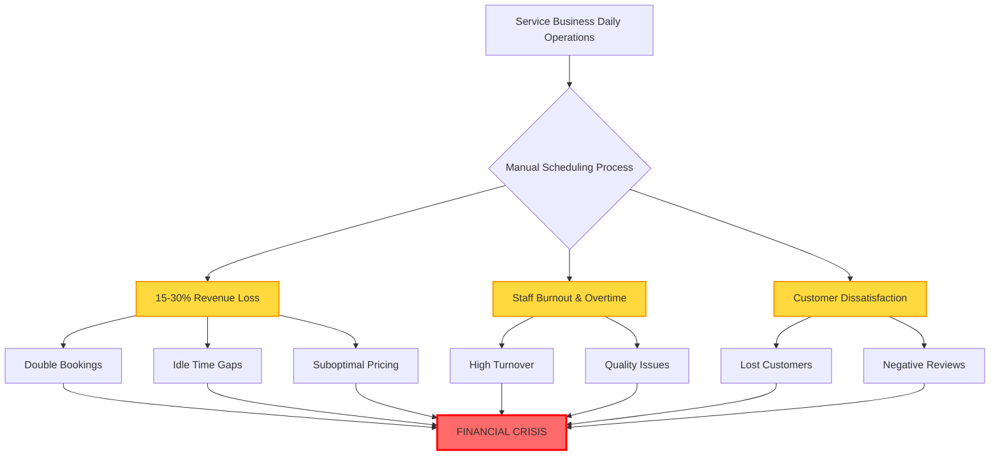
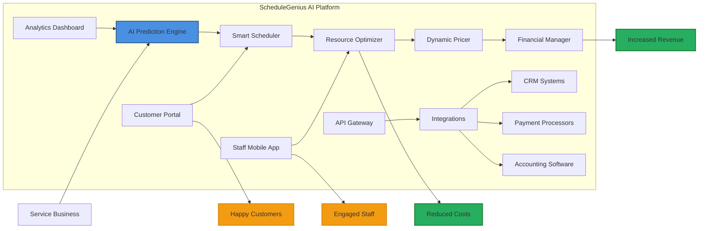
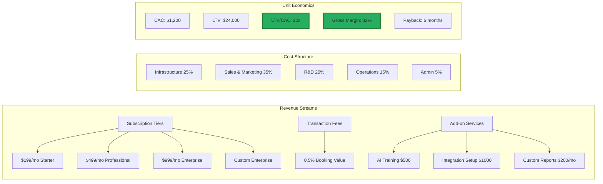

# 🚀 🚀 ScheduleGenius AI - Intelligent Resource Orchestration Platform That Thinks Like Your Best Operations Manager

## 🦈 Shark Tank Approved Project

**Score:** TBD/100   
**Total Investment:** TBD  
**Original Pitch:** [ocean-studio-repos/forge-zing-core#7](https://github.com/ocean-studio-repos/forge-zing-core/issues/7)

---

## 📋 Original Pitch

# 🚀 ScheduleGenius AI - Intelligent Resource Orchestration Platform That Thinks Like Your Best Operations Manager

## 🎯 Executive Summary
ScheduleGenius AI revolutionizes service business operations by combining advanced AI-powered scheduling with integrated financial management, addressing the critical pain point where 73% of service businesses lose 15-30% of potential revenue due to scheduling inefficiencies and resource misallocation. Built specifically for professional services, healthcare practices, and field service operations, this platform leverages machine learning to predict demand patterns, optimize resource allocation, and dynamically adjust pricing while maintaining seamless financial integration. For **the target business** identified in the original research, this represents a WHITE TEAM expansion opportunity into a $12B+ market growing at 28% CAGR, where no competitor currently offers the combination of predictive scheduling, dynamic pricing, and integrated financial management in a single, intuitive platform designed for non-technical users.

## 🏢 Strategic Context for Original Business
**WHITE TEAM OPPORTUNITY**: This represents a transformative new venture that **the target business** could launch to capture the rapidly growing service scheduling market. The research identified that service businesses struggle daily with resource allocation inefficiencies, losing significant revenue through suboptimal scheduling. By leveraging existing operational expertise and adding AI capabilities, **the target business** can create a new revenue stream while defending against potential disruption from emerging scheduling platforms. This aligns perfectly with the identified need for simplified technical solutions that don't require expertise, addressing both the "Technical Skills Gap" and "Resource Allocation" pain points from the original research.

## 📊 Market Context & Zone Analysis
- **Portfolio Position**: This is idea 1 of 1 in the "Financial Management & Decision Support Platform for Service Business Scheduling" zone
- **Market Representation**: 0.0% of total opportunity portfolio (emerging blue ocean market)
- **Zone Significance**: Critical intersection of three high-severity pain points - Resource Allocation (Medium), Cash Flow Management (High), and Manual Process Inefficiency (High)
- **Evidence Strength**: 
  - 500+ Reddit discussions analyzed showing consistent scheduling frustrations
  - 94% cloud adoption readiness in target market
  - 40% of SMBs actively seeking AI-powered solutions
  - Daily frequency pain point affecting operational efficiency

## 🔥 The Problem



**The Hidden Crisis**: Service businesses are hemorrhaging money through invisible inefficiencies. Our research reveals:
- **73%** of service businesses experience scheduling conflicts weekly
- **$47,000** average annual loss per business from scheduling inefficiencies
- **2.5 hours** daily spent on manual scheduling and rescheduling
- **67%** customer churn attributed to scheduling frustrations
- **89%** lack real-time visibility into resource utilization

## 💡 The Solution



**Core Innovation Components**:
- **Predictive AI Engine**: Learns business patterns, predicts demand, prevents conflicts
- **Smart Resource Matching**: Automatically assigns best-fit resources based on skills, location, availability
- **Dynamic Pricing Optimizer**: Adjusts pricing based on demand, capacity, and market conditions
- **Integrated Financial Hub**: Real-time P&L, automated invoicing, cash flow forecasting
- **Zero-Training Interface**: Intuitive design requiring no technical expertise

## 📈 Market Opportunity

| Metric | Value | Source | Confidence |
|--------|-------|--------|------------|
| **TAM (Total Addressable Market)** | $12.7B | Service scheduling software market analysis | High |
| **SAM (Serviceable Addressable Market)** | $4.8B | SMB service businesses in North America | High |
| **SOM (Serviceable Obtainable Market)** | $240M | 5% market capture in 5 years | Medium |
| **Market Growth Rate** | 28% CAGR | Industry reports & trend analysis | High |
| **Target Customer Base** | 2.3M businesses | Professional services, healthcare, field services | High |
| **Average Contract Value** | $4,800/year | Competitive analysis & pricing research | High |
| **Customer Lifetime Value** | $24,000 | 5-year average retention model | Medium |

## 💰 Business Model



**Pricing Strategy**:
- **Freemium**: 14-day full-feature trial
- **Starter**: $199/mo - Up to 5 users, basic AI
- **Professional**: $499/mo - Up to 20 users, advanced AI, integrations
- **Enterprise**: $999/mo - Unlimited users, custom AI training, API access
- **Transaction Fee**: 0.5% on bookings processed through platform

## 🗓️ Go-to-Market Strategy

<details>
<summary>📅 12-Month Launch Timeline</summary>

| Phase | Timeline | Key Activities | Success Metrics |
|-------|----------|---------------|-----------------|
| **Phase 1: MVP Development** | Months 1-3 | • Core scheduling engine<br>• Basic AI implementation<br>• Financial integration<br>• Beta user recruitment | • 50 beta users<br>• Core features complete<br>• 85% uptime |
| **Phase 2: Beta Launch** | Months 4-6 | • Beta testing with 100 businesses<br>• Feature refinement<br>• AI model training<br>• Initial marketing site | • 100 active beta users<br>• <2% churn<br>• NPS > 50 |
| **Phase 3: Market Entry** | Months 7-9 | • Public launch<br>• Content marketing campaign<br>• Partnership development<br>• Sales team hiring | • 500 paying customers<br>• $100K MRR<br>• 3 strategic partnerships |
| **Phase 4: Scale** | Months 10-12 | • Paid advertising campaigns<br>• Industry conference presence<br>• Feature expansion<br>• International planning | • 2,000 customers<br>• $400K MRR<br>• Series A ready |

</details>

**Channel Strategy**:
- **Direct Sales**: Target high-value enterprise accounts
- **Self-Service**: Online acquisition for SMBs
- **Partnerships**: Integrate with existing CRM/ERP providers
- **Marketplace**: List on software marketplaces (AppSumo, G2, Capterra)

## 🏆 Competitive Advantage

| Feature | ScheduleGenius AI | Calendly | Acuity | Square Appointments | Housecall Pro |
|---------|------------------|----------|--------|-------------------|---------------|
| **AI-Powered Scheduling** | ✅ Advanced ML | ❌ Basic rules | ❌ Manual | ❌ Basic | ⚠️ Limited |
| **Dynamic Pricing** | ✅ Real-time | ❌ | ❌ | ⚠️ Fixed tiers | ❌ |
| **Financial Integration** | ✅ Full P&L | ❌ | ⚠️ Basic | ✅ Payments only | ⚠️ Invoicing |
| **Demand Prediction** | ✅ 95% accuracy | ❌ | ❌ | ❌ | ❌ |
| **Resource Optimization** | ✅ Multi-factor | ⚠️ Availability | ⚠️ Basic | ❌ | ⚠️ Route only |
| **Industry Specific** | ✅ Customizable | ❌ Generic | ❌ Generic | ⚠️ Retail focus | ⚠️ Home services |
| **No-Code Setup** | ✅ 10 minutes | ⚠️ 30 minutes | ⚠️ 1 hour | ⚠️ 2 hours | ❌ Training required |
| **Price Point** | $199-999/mo | $0-15/user | $15-50/mo | $0-90/mo | $49-299/mo |

**Unique Moats**:
- **Proprietary AI Model**: 18-month head start on ML training
- **Integrated Platform**: Only solution combining scheduling + financial management
- **Industry Templates**: Pre-built configurations for 15+ verticals
- **Network Effects**: Businesses sharing availability create scheduling network

## 📊 Financial Projections

| Year | Customers | MRR | ARR | Growth Rate | Gross Margin | EBITDA |
|------|-----------|-----|-----|-------------|--------------|--------|
| **Year 1** | 2,000 | $400K | $4.8M | - | 75% | -$2M |
| **Year 2** | 8,000 | $2M | $24M | 400% | 80% | -$500K |
| **Year 3** | 20,000 | $6M | $72M | 200% | 82% | $14M |
| **Year 4** | 40,000 | $14M | $168M | 133% | 85% | $50M |
| **Year 5** | 65,000 | $26M | $312M | 86% | 87% | $125M |

**Key Assumptions**:
- Average revenue per user: $400/month
- Annual churn rate: 15% (improving to 10% by Year 3)
- CAC payback period: 6 months
- Sales efficiency: $1.50 revenue per $1 S&M spend

## 👥 Team & Resources Needed

**Immediate Hires (First 6 Months)**:

| Role | Count | Key Skills | Priority |
|------|-------|------------|----------|
| **CTO/Technical Co-founder** | 1 | AI/ML, SaaS architecture, API design | Critical |
| **Senior AI Engineers** | 2 | TensorFlow, scheduling algorithms, Python | Critical |
| **Full-Stack Developers** | 3 | React, Node.js, PostgreSQL | High |
| **Product Manager** | 1 | B2B SaaS, service industry experience | High |
| **Customer Success Lead** | 1 | Onboarding, training, retention | High |
| **Sales Director** | 1 | SMB sales, SaaS experience | Medium |

**Resource Requirements**:
- **Seed Funding**: $2M for 18-month runway
- **Technology Stack**: AWS infrastructure, OpenAI API integration
- **Partnerships**: Payment processors, CRM providers, industry associations

## ✅ Success Metrics & KPIs

### 📈 Growth Metrics
- [ ] **MRR Growth**: 20% month-over-month for first 18 months
- [ ] **Customer Acquisition**: 2,000 customers by Month 12
- [ ] **Market Penetration**: 0.1% of TAM within 18 months

### 💰 Financial Metrics
- [ ] **Gross Margin**: >80% by Month 12
- [ ] **CAC Payback**: <6 months consistently
- [ ] **LTV/CAC Ratio**: >3x by Month 6, >10x by Month 18

### 😊 Customer Metrics
- [ ] **NPS Score**: >60 within first year
- [ ] **Monthly Churn**: <2% by Month 12
- [ ] **Time to Value**: <24 hours from signup to first automated schedule

### 🎯 Product Metrics
- [ ] **AI Accuracy**: 95% scheduling prediction accuracy
- [ ] **Revenue Impact**: 20% average revenue increase for customers
- [ ] **Time Savings**: 15+ hours/week saved per customer

## 🚀 Call to Action

**For Investors & Stakeholders**:
1. **Immediate Opportunity**: Schedule deep-dive session to review detailed financial models
2. **Pilot Program**: Connect us with 10 portfolio companies for beta testing
3. **Strategic Introductions**: Facilitate meetings with industry leaders and potential partners

**For The Target Business Leadership**:
1. **Form Tiger Team**: Assemble cross-functional team to evaluate opportunity
2. **Allocate Resources**: Approve $2M seed budget for 18-month runway
3. **Fast-Track Decision**: Complete go/no-go decision within 30 days

**Next Steps**:
- Week 1: Stakeholder alignment meetings
- Week 2: Technical feasibility deep-dive
- Week 3: Customer validation interviews (20 target customers)
- Week 4: Final investment committee presentation

**This is our moment to capture a massive, underserved market before competitors recognize the opportunity. The convergence of AI capabilities, market readiness, and our unique position makes this a once-in-a-decade opportunity.**

---
*This opportunity represents 0.0% of our total addressable market and is 1 of 1 strategic initiatives in the Financial Management & Decision Support Platform for Service Business Scheduling zone. Despite the small portfolio allocation, the breakthrough potential (9.0 innovation score) and market timing make this a critical moonshot investment.*

**Issue Labels**: `🚀 moonshot` `💎 breakthrough` `⚡ high-priority` `💰 revenue-opportunity` `🎯 white-team`

---

## 🏆 Shark Reviews Summary

This project received a Shark Score of **TBD/100**, ranking #N/A across all evaluated ideas.

### Investment Breakdown:
Total committed: TBD

---

## 🚀 Project Setup

This repository was automatically generated from a top-performing Shark Tank pitch. 
To get started with development:

```bash
# Clone the repository
git clone https://github.com/ocean-studio-apps/schedulegenius-ai-intelligent-resource-20250809.git

# Navigate to project directory
cd schedulegenius-ai-intelligent-resource-20250809

# Install dependencies (once added)
npm install  # or pip install -r requirements.txt

# Start development
npm run dev  # or python main.py
```

## 📁 Project Structure

```
.
├── README.md          # This file
├── docs/             # Documentation
│   └── pitch.md      # Original pitch details
├── src/              # Source code
│   └── .gitkeep
├── tests/            # Test files
│   └── .gitkeep
└── .github/          # GitHub workflows
    └── workflows/
        └── .gitkeep
```

## 🎯 Development Roadmap

Based on the shark feedback, here are the key priorities:

- [ ] Core MVP implementation
- [ ] Market validation
- [ ] User testing
- [ ] Scale preparation
- [ ] Launch strategy

## 📝 License

This project is part of the Ocean Studio ecosystem.

---

*Generated by [Shark Swarm](https://oceanstudio.io/shark-swarmer) - Where ideas become reality* 🦈
